# Corpus Health Report

Status: FCR structural registry generated from active LaTeX sources. This report is a validation surface, not a claim that the mathematics is proved.

## Metrics

- Formal registry entries: 745
- Macro registry entries: 432
- Theorem entries: 97
- Hypothesis entries: 21
- Conjecture entries: 9
- Audit v5 overlays: 20
- False-status entries with required counterexample metadata: 0
- Proved-status entries: 239
- Conditional-status entries: 346
- Heuristic-status entries: 148
- Active macro-collision entries: 0
- Active macro-collision groups: 0
- Blocking validation errors: 0
- Non-blocking warnings: 0

## Audit-Flagged Formal Entries

| ID | Status | Proof | Audit status | Location |
|---|---|---|---|---|
| basecore:hypothesis:hyp-phi-regularity | conditional | not_applicable | corrected_from_false_theorem | basecore/core/sections/04_regime_constraints_absorbed.tex:385 |
| basecore:theorem:thm-minimal-positive-regime | conditional | present | assumption_explicit | basecore/core/sections/05_null_regime_absorbed.tex:79 |
| basecore:conjecture:thm-rigidity-inheritance | conjectural | not_expected | demoted_to_conjecture | basecore/core/sections/05_null_regime_absorbed.tex:131 |
| basecore:conjecture:thm-null-categorical-universality | conjectural | not_expected | demoted_to_conjecture | basecore/core/sections/05_null_regime_absorbed.tex:135 |
| basecore:conjecture:thm-null-simulation-lower-bound | conjectural | not_expected | demoted_to_conjecture | basecore/core/sections/05_null_regime_absorbed.tex:139 |
| basecore:conjecture:thm-null-closure-by-non-alternatives | conjectural | not_expected | demoted_to_conjecture | basecore/core/sections/05_null_regime_absorbed.tex:143 |
| paper1:theorem:thm-aleph-unique | conditional | present | corrected_with_strict_convexity_hypothesis | paper1/main.tex:1060 |
| paper1:remark:thm-info-isolation | heuristic | not_applicable | corrected_to_epistemic_boundary | paper1/main.tex:1099 |
| paper1:remark:thm-stone-classification | heuristic | not_applicable | corrected_to_boundary_remark | paper1/main.tex:1236 |
| paper10:theorem:thm-null-forced | conditional | present | corrected_forced_choice_variant | paper10_external_adjudication/main.tex:571 |
| paper2:hypothesis:hyp-phi-paper2 | conditional | not_applicable | corrected_from_false_theorem | paper2/main.tex:561 |
| paper3:theorem:thm-instability | conditional | present | corrected_pointwise_c3 | paper3/main.tex:322 |
| paper3:conjecture:profinite-coupling-bound-l692 | conjectural | not_expected | demoted_to_conjecture | paper3/main.tex:692 |
| paper3:theorem:thm-sim-cond | conditional | present | corrected_to_conditional | paper3/main.tex:821 |
| paper8:theorem:thm-selfindex-emergence | conditional | heuristic | proof_gap | paper8_first_person_subjectivity/main.tex:557 |
| paper8:theorem:thm-ownership-nontransfer | tautology | invalid | circular_definition | paper8_first_person_subjectivity/main.tex:604 |
| paper8:theorem:thm-five-field-reduction | conjectural | sketch | proof_sketch | paper8_first_person_subjectivity/main.tex:612 |
| paper9:conjecture:thm-predicate-independence | conjectural | not_expected | demoted_to_conjecture_circular_witness | paper9_phenomenal_bridge_organization/main.tex:1348 |
| paper9:conjecture:thm-registry-independence | conjectural | not_expected | demoted_to_conjecture_circular_witness | paper9_phenomenal_bridge_organization/main.tex:1356 |
| paper9:theorem:thm-bridge-realization-exists | tautology | heuristic | vacuous_non_emptiness | paper9_phenomenal_bridge_organization/main.tex:1372 |

## Blockers

None.

## Warning Sample

None.

## Dependency Graph

```mermaid
graph TD
    basecore_hypothesis_hyp_h1["basecore:hypothesis:hyp-h1"] --> basecore_theorem_thm_projection["basecore:theorem:thm-projection"]
    basecore_hypothesis_hyp_h1["basecore:hypothesis:hyp-h1"] --> basecore_theorem_thm_contraction["basecore:theorem:thm-contraction"]
    basecore_hypothesis_hyp_h2["basecore:hypothesis:hyp-h2"] --> basecore_theorem_thm_contraction["basecore:theorem:thm-contraction"]
    basecore_lemma_lem_nonexp["basecore:lemma:lem-nonexp"] --> basecore_theorem_thm_contraction["basecore:theorem:thm-contraction"]
    basecore_hypothesis_hyp_h1["basecore:hypothesis:hyp-h1"] --> basecore_theorem_thm_fixedpoint["basecore:theorem:thm-fixedpoint"]
    basecore_hypothesis_hyp_h3_basecorecoresections01_foundation_from_core_l43["basecore:hypothesis:hyp-h3-basecorecoresections01-foundation-from-core-l43"] --> basecore_theorem_thm_fixedpoint["basecore:theorem:thm-fixedpoint"]
    basecore_theorem_thm_contraction["basecore:theorem:thm-contraction"] --> basecore_theorem_thm_fixedpoint["basecore:theorem:thm-fixedpoint"]
    basecore_hypothesis_hyp_h1["basecore:hypothesis:hyp-h1"] --> basecore_theorem_thm_compactness["basecore:theorem:thm-compactness"]
    basecore_hypothesis_hyp_h4["basecore:hypothesis:hyp-h4"] --> basecore_theorem_thm_compactness["basecore:theorem:thm-compactness"]
    basecore_hypothesis_hyp_h1["basecore:hypothesis:hyp-h1"] --> basecore_theorem_thm_noncollapse["basecore:theorem:thm-noncollapse"]
    basecore_hypothesis_hyp_h5["basecore:hypothesis:hyp-h5"] --> basecore_theorem_thm_noncollapse["basecore:theorem:thm-noncollapse"]
    basecore_theorem_thm_spectrum["basecore:theorem:thm-spectrum"] --> basecore_theorem_thm_relaxation["basecore:theorem:thm-relaxation"]
    basecore_hypothesis_hyp_nfd["basecore:hypothesis:hyp-nfd"] --> basecore_theorem_prop_nonlocality["basecore:theorem:prop-nonlocality"]
    basecore_hypothesis_hyp_topo["basecore:hypothesis:hyp-topo"] --> basecore_theorem_prop_nonlocality["basecore:theorem:prop-nonlocality"]
    basecore_theorem_thm_non_simulability["basecore:theorem:thm-non-simulability"] --> basecore_theorem_approximation_barrier_l213["basecore:theorem:approximation-barrier-l213"]
    basecore_hypothesis_hyp_phi_regularity["basecore:hypothesis:hyp-phi-regularity"] --> basecore_theorem_thm_fragmentation["basecore:theorem:thm-fragmentation"]
    basecore_theorem_thm_forced_continuity["basecore:theorem:thm-forced-continuity"] --> basecore_theorem_thm_dichotomy["basecore:theorem:thm-dichotomy"]
    basecore_theorem_thm_fragmentation["basecore:theorem:thm-fragmentation"] --> basecore_theorem_thm_dichotomy["basecore:theorem:thm-dichotomy"]
    basecore_definition_def_compatibility_operator["basecore:definition:def-compatibility-operator"] --> basecore_theorem_thm_phenomenological_instability["basecore:theorem:thm-phenomenological-instability"]
    basecore_assumption_ass_positive_regime_completeness["basecore:assumption:ass-positive-regime-completeness"] --> basecore_theorem_thm_minimal_positive_regime["basecore:theorem:thm-minimal-positive-regime"]
    basecore_definition_def_structural_intensity["basecore:definition:def-structural-intensity"] --> basecore_theorem_thm_universal_intensity_bound["basecore:theorem:thm-universal-intensity-bound"]
    basecore_assumption_ass_positive_regime_completeness["basecore:assumption:ass-positive-regime-completeness"] --> basecore_theorem_thm_forced_phenomenological_closure["basecore:theorem:thm-forced-phenomenological-closure"]
    basecore_corollary_cor_forced_non_nullity["basecore:corollary:cor-forced-non-nullity"] --> basecore_theorem_thm_forced_phenomenological_closure["basecore:theorem:thm-forced-phenomenological-closure"]
    basecore_theorem_thm_minimal_positive_regime["basecore:theorem:thm-minimal-positive-regime"] --> basecore_theorem_thm_forced_phenomenological_closure["basecore:theorem:thm-forced-phenomenological-closure"]
    basecore_theorem_thm_phenomenological_instability["basecore:theorem:thm-phenomenological-instability"] --> basecore_theorem_thm_forced_phenomenological_closure["basecore:theorem:thm-forced-phenomenological-closure"]
    basecore_theorem_thm_universal_intensity_bound["basecore:theorem:thm-universal-intensity-bound"] --> basecore_theorem_thm_forced_phenomenological_closure["basecore:theorem:thm-forced-phenomenological-closure"]
    basecore_criterion_crit_cert["basecore:criterion:crit-cert"] --> basecore_theorem_certified_criterion_membership_l326["basecore:theorem:certified-criterion-membership-l326"]
    basecore_definition_def_cop["basecore:definition:def-cop"] --> basecore_theorem_certified_criterion_membership_l326["basecore:theorem:certified-criterion-membership-l326"]
    basecore_proposition_prop_qop_welldefined["basecore:proposition:prop-qop-welldefined"] --> basecore_theorem_certified_criterion_membership_l326["basecore:theorem:certified-criterion-membership-l326"]
    basecore_assumption_ass_discrete_regularity["basecore:assumption:ass-discrete-regularity"] --> basecore_theorem_thm_discrete_contraction["basecore:theorem:thm-discrete-contraction"]
    basecore_assumption_ass_bridge_consistency["basecore:assumption:ass-bridge-consistency"] --> basecore_theorem_thm_bridge_conditional["basecore:theorem:thm-bridge-conditional"]
    basecore_assumption_ass_discrete_regularity["basecore:assumption:ass-discrete-regularity"] --> basecore_theorem_thm_bridge_conditional["basecore:theorem:thm-bridge-conditional"]
    basecore_hypothesis_hyp_h1["basecore:hypothesis:hyp-h1"] --> basecore_theorem_thm_bridge_conditional["basecore:theorem:thm-bridge-conditional"]
    basecore_hypothesis_hyp_h4["basecore:hypothesis:hyp-h4"] --> basecore_theorem_thm_bridge_conditional["basecore:theorem:thm-bridge-conditional"]
    bridge_corollary_cor_cop_qop["bridge:corollary:cor-cop-qop"] --> bridge_theorem_thm_subbridge_generated["bridge:theorem:thm-subbridge-generated"]
    bridge_definition_def_sigma_op["bridge:definition:def-sigma-op"] --> bridge_theorem_thm_subbridge_generated["bridge:theorem:thm-subbridge-generated"]
    bridge_definition_def_subbridge["bridge:definition:def-subbridge"] --> bridge_theorem_thm_subbridge_generated["bridge:theorem:thm-subbridge-generated"]
    bridge_observation_thm_cop_entails_iota["bridge:observation:thm-cop-entails-iota"] --> bridge_theorem_thm_subbridge_generated["bridge:theorem:thm-subbridge-generated"]
    bridge_observation_thm_cop_entails_pi["bridge:observation:thm-cop-entails-pi"] --> bridge_theorem_thm_subbridge_generated["bridge:theorem:thm-subbridge-generated"]
    bridge_proposition_prop_qop_nontrivial["bridge:proposition:prop-qop-nontrivial"] --> bridge_theorem_thm_subbridge_generated["bridge:theorem:thm-subbridge-generated"]
    bridge_proposition_prop_weak_phi["bridge:proposition:prop-weak-phi"] --> bridge_theorem_thm_subbridge_generated["bridge:theorem:thm-subbridge-generated"]
    bridge_corollary_cor_cop_qop["bridge:corollary:cor-cop-qop"] --> bridge_theorem_thm_main_partial_subjecthood["bridge:theorem:thm-main-partial-subjecthood"]
    bridge_observation_thm_cop_entails_iota["bridge:observation:thm-cop-entails-iota"] --> bridge_theorem_thm_main_partial_subjecthood["bridge:theorem:thm-main-partial-subjecthood"]
    bridge_observation_thm_cop_entails_pi["bridge:observation:thm-cop-entails-pi"] --> bridge_theorem_thm_main_partial_subjecthood["bridge:theorem:thm-main-partial-subjecthood"]
    bridge_observation_thm_subbridge_subset["bridge:observation:thm-subbridge-subset"] --> bridge_theorem_thm_main_partial_subjecthood["bridge:theorem:thm-main-partial-subjecthood"]
    bridge_proposition_prop_sigma_not_entailed["bridge:proposition:prop-sigma-not-entailed"] --> bridge_theorem_thm_main_partial_subjecthood["bridge:theorem:thm-main-partial-subjecthood"]
    bridge_proposition_prop_weak_phi["bridge:proposition:prop-weak-phi"] --> bridge_theorem_thm_main_partial_subjecthood["bridge:theorem:thm-main-partial-subjecthood"]
    bridge_definition_def_bridge_cop["bridge:definition:def-bridge-cop"] --> bridge_theorem_thm_nonentailment_library["bridge:theorem:thm-nonentailment-library"]
    bridge_proposition_prop_cop_not_ccr["bridge:proposition:prop-cop-not-ccr"] --> bridge_theorem_thm_nonentailment_library["bridge:theorem:thm-nonentailment-library"]
    paper1_lemma_lem_stability["paper1:lemma:lem-stability"] --> paper1_theorem_thm_rigidity["paper1:theorem:thm-rigidity"]
    paper1_definition_def_ontmass["paper1:definition:def-ontmass"] --> paper1_theorem_thm_detectability["paper1:theorem:thm-detectability"]
    paper1_theorem_thm_rigidity["paper1:theorem:thm-rigidity"] --> paper1_theorem_thm_detectability["paper1:theorem:thm-detectability"]
    paper1_definition_def_ontmass["paper1:definition:def-ontmass"] --> paper1_conjecture_conj_lmmem["paper1:conjecture:conj-lmmem"]
    paper1_conjecture_conj_lmmem["paper1:conjecture:conj-lmmem"] --> paper1_theorem_thm_lmmem_conditioned["paper1:theorem:thm-lmmem-conditioned"]
    paper1_theorem_thm_rigidity["paper1:theorem:thm-rigidity"] --> paper1_theorem_thm_lmmem_conditioned["paper1:theorem:thm-lmmem-conditioned"]
    paper1_hypothesis_hyp_strict_convex["paper1:hypothesis:hyp-strict-convex"] --> paper1_theorem_thm_aleph_unique["paper1:theorem:thm-aleph-unique"]
    paper1_hypothesis_hyp_topo["paper1:hypothesis:hyp-topo"] --> paper1_theorem_thm_aleph_unique["paper1:theorem:thm-aleph-unique"]
    paper1_theorem_thm_collapse["paper1:theorem:thm-collapse"] --> paper1_theorem_thm_nosemigroup["paper1:theorem:thm-nosemigroup"]
    paper1_definition_def_ontmass["paper1:definition:def-ontmass"] --> paper1_theorem_thm_non_simulability["paper1:theorem:thm-non-simulability"]
    paper1_theorem_thm_rigidity["paper1:theorem:thm-rigidity"] --> paper1_theorem_thm_non_simulability["paper1:theorem:thm-non-simulability"]
    paper1_theorem_thm_rigidity["paper1:theorem:thm-rigidity"] --> paper1_theorem_thm_stratification["paper1:theorem:thm-stratification"]
    paper10_definition_def_blind_adjudicator_loss["paper10:definition:def-blind-adjudicator-loss"] --> paper10_theorem_thm_null_tie["paper10:theorem:thm-null-tie"]
    paper2_hypothesis_hyp_phi_paper2["paper2:hypothesis:hyp-phi-paper2"] --> paper2_theorem_thm_fragmentation["paper2:theorem:thm-fragmentation"]
    paper2_hypothesis_hyp_phi_paper2["paper2:hypothesis:hyp-phi-paper2"] --> paper2_theorem_thm_dichotomy["paper2:theorem:thm-dichotomy"]
    paper2_theorem_thm_forced_continuity["paper2:theorem:thm-forced-continuity"] --> paper2_theorem_thm_dichotomy["paper2:theorem:thm-dichotomy"]
    paper2_theorem_thm_fragmentation["paper2:theorem:thm-fragmentation"] --> paper2_theorem_thm_dichotomy["paper2:theorem:thm-dichotomy"]
    paper2_hypothesis_hyp_phi_paper2["paper2:hypothesis:hyp-phi-paper2"] --> paper2_theorem_thm_loss["paper2:theorem:thm-loss"]
    paper2_theorem_thm_forced_continuity["paper2:theorem:thm-forced-continuity"] --> paper2_theorem_thm_loss["paper2:theorem:thm-loss"]
    paper2_theorem_thm_fragmentation["paper2:theorem:thm-fragmentation"] --> paper2_theorem_thm_loss["paper2:theorem:thm-loss"]
    paper3_lemma_lem_no_collapse["paper3:lemma:lem-no-collapse"] --> paper3_theorem_thm_minimal["paper3:theorem:thm-minimal"]
    paper3_corollary_cor_forced["paper3:corollary:cor-forced"] --> paper3_theorem_thm_closure["paper3:theorem:thm-closure"]
    paper3_theorem_thm_bound["paper3:theorem:thm-bound"] --> paper3_theorem_thm_closure["paper3:theorem:thm-closure"]
    paper3_theorem_thm_instability["paper3:theorem:thm-instability"] --> paper3_theorem_thm_closure["paper3:theorem:thm-closure"]
    paper3_theorem_thm_minimal["paper3:theorem:thm-minimal"] --> paper3_theorem_thm_closure["paper3:theorem:thm-closure"]
    paper5_definition_def_cop["paper5:definition:def-cop"] --> paper5_theorem_thm_existence["paper5:theorem:thm-existence"]
    paper5_proposition_prop_qop_welldefined["paper5:proposition:prop-qop-welldefined"] --> paper5_theorem_thm_existence["paper5:theorem:thm-existence"]
    paper5_definition_def_equiv["paper5:definition:def-equiv"] --> paper5_theorem_thm_substrate["paper5:theorem:thm-substrate"]
    paper5_definition_def_cop["paper5:definition:def-cop"] --> paper5_theorem_thm_stability["paper5:theorem:thm-stability"]
    paper5_definition_def_equiv["paper5:definition:def-equiv"] --> paper5_theorem_thm_stability["paper5:theorem:thm-stability"]
    paper5_proposition_prop_necessity["paper5:proposition:prop-necessity"] --> paper5_theorem_thm_rupture["paper5:theorem:thm-rupture"]
    paper5_proposition_prop_witness["paper5:proposition:prop-witness"] --> paper5_theorem_thm_minimality["paper5:theorem:thm-minimality"]
    paper5_definition_def_cop["paper5:definition:def-cop"] --> paper5_theorem_thm_six_sufficiency["paper5:theorem:thm-six-sufficiency"]
    paper5_corollary_cor_onemetric["paper5:corollary:cor-onemetric"] --> paper5_theorem_thm_intermediate["paper5:theorem:thm-intermediate"]
    paper5_proposition_prop_baseline_insufficient["paper5:proposition:prop-baseline-insufficient"] --> paper5_theorem_thm_intermediate["paper5:theorem:thm-intermediate"]
    paper5_proposition_prop_functional_weak["paper5:proposition:prop-functional-weak"] --> paper5_theorem_thm_intermediate["paper5:theorem:thm-intermediate"]
    paper5_proposition_prop_substrate_strong["paper5:proposition:prop-substrate-strong"] --> paper5_theorem_thm_intermediate["paper5:theorem:thm-intermediate"]
    paper7_definition_def_ossi["paper7:definition:def-ossi"] --> paper7_conjecture_conj_ossi_ind["paper7:conjecture:conj-ossi-ind"]
    paper7_definition_def_lcbridge["paper7:definition:def-lcbridge"] --> paper7_theorem_thm_cop_open_system_composition["paper7:theorem:thm-cop-open-system-composition"]
    paper7_proposition_prop_ossi_not_cop["paper7:proposition:prop-ossi-not-cop"] --> paper7_theorem_thm_cop_open_system_composition["paper7:theorem:thm-cop-open-system-composition"]
    paper7_definition_def_cop["paper7:definition:def-cop"] --> paper7_theorem_thm_conditional_life_to_consciousness["paper7:theorem:thm-conditional-life-to-consciousness"]
    paper7_theorem_thm_life_consciousness_incomparable["paper7:theorem:thm-life-consciousness-incomparable"] --> paper7_theorem_thm_exact_class_hierarchy["paper7:theorem:thm-exact-class-hierarchy"]
    paper8_assumption_ass_margin_reg["paper8:assumption:ass-margin-reg"] --> paper8_theorem_thm_selfindex_emergence["paper8:theorem:thm-selfindex-emergence"]
    paper8_definition_def_ownership_morphism["paper8:definition:def-ownership-morphism"] --> paper8_theorem_thm_ownership_nontransfer["paper8:theorem:thm-ownership-nontransfer"]
```

