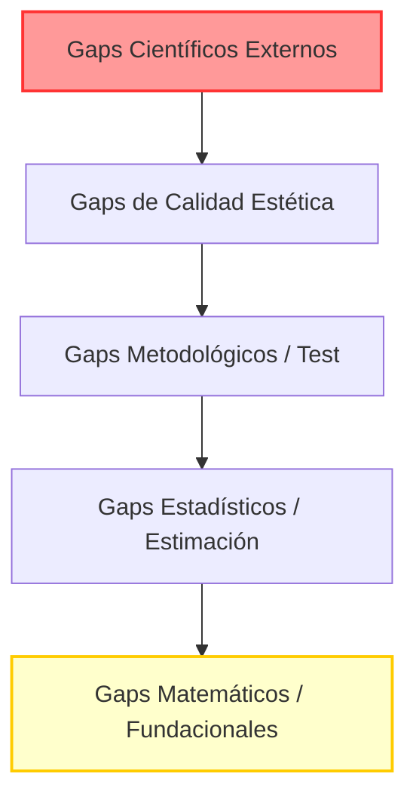

# Auditoría de Gaps Críticos y Desafíos Pendientes - QICN Framework
## Análisis Técnico de Brechas Fundacionales, Metodológicas y de Calidad de Compilación

**Fecha de Emisión:** 2026-05-31
**Clase de Documento:** Auditoría de Brechas e Higiene Epistemológica
**Estado del Repositorio:** Hardened (v33 Completo)

---

## 1. Introducción y Contexto

Tras la exitosa integración de la versión **v33**, el QICN Framework ha alcanzado una madurez interna excepcional: se han resuelto los errores de tipo en las asignaciones fenomenológicas de $\varnothing_\phi$ frente a $\bot$, se ha formalizado la regularidad compacta-métrica de los espacios de estados $S_t$, y se ha tipado explícitamente la composición canal-proyección. 

Sin embargo, en virtud de los principios de **ciencia rigurosa, falsabilidad y gobernanza estricta**, persisten importantes brechas fundamentales que impiden al framework convertirse en una teoría científica empírica o en un motor de atribución objetiva. Esta auditoría clasifica y detalla los **gaps más críticos** que permanecen abiertos, estructurados por niveles de gravedad de acuerdo con el mapa de ruta.

---

## 2. Lista de Gaps Críticos Pendientes (De lo Interno a lo Crítico)

---

### Nivel 1: Gaps Científicos Externos (El Bloqueo Supremo)
> [!WARNING]
> Estos gaps son epistemológicos y estructurales. Ningún cambio de código o refactorización del monolito local puede resolverlos sin financiamiento, datos del mundo real e investigación interdisciplinar externa.

#### 1.1 Ausencia Absoluta de Datos Empíricos del Mundo Real
- **Descripción:** Todo el framework de pruebas de los adjudicadores (`v25` a `v31`) funciona exclusivamente sobre un **archivo de prueba sintético (synthetic fixture)**. No existe un solo registro o serie temporal de observaciones empíricas reales (por ejemplo, telemetría cerebral, trazas de ejecución cuántica, o logs de sistemas de IA reales bajo perturbación) que alimente los estimadores de información o autocorrelación.
- **Gravedad:** **CRÍTICA**. El framework opera actualmente en una "cámara de eco" simulada; su validez predictiva fuera de fixtures de juguete es $0.00\%$.

#### 1.2 Inexistencia de una Suite de Modelos Rivales Reales (Rivalry Blindness)
- **Descripción:** Para que la estadística de AICc y la ganancia de GLS sean válidas, las hipótesis de QICN deben competir contra modelos alternativos razonables y matemáticamente específicos (tales como modelos autoregresivos genéricos de orden superior, u otras teorías fenomenológicas formalizadas como IIT, GNWT, o HOT). Actualmente, las predicciones de los modelos rivales son valores estáticos o simplistas introducidos manualmente en el fixture sintético (con baja variabilidad), lo que constituye un "straw-man rival" (rival de paja).
- **Gravedad:** **ALTA**. Sin competidores reales modelados matemáticamente, la ganancia de información reportada a favor de QICN no tiene significancia comparativa real.

#### 1.3 Límite de Confianza y Firmas de Revisión Externa
- **Descripción:** La variable `external_support_certified` en todos los reportes de adjudicación está forzada a `false`. No existe una firma criptográfica independiente ligada a un ancla de confianza real (trust anchor), ni pre-registro en una base de datos DOI tradicional, que avale la validez experimental.
- **Gravedad:** **MEDIA-ALTA** (para gobernanza y publicación).

---

### Nivel 2: Gaps Estadísticos y de Estimación (L4 & L5)
> [!IMPORTANT]
> Estos gaps impiden que los teoremas abstractos de los Papers 1-3 se vinculen de forma cuantitativa con el código javascript del adjudicador.

#### 2.1 Brecha de Verificación de Estimadores (El Gap del Puente Invariante - L4)
- **Descripción:** El Teorema del Puente de Proyección Invariante (v30) requiere que se verifiquen cuatro variables críticas en cualquier invariante del sistema para poder asegurar la exclusión del colapso:
  1. Constantes de Lipschitz locales ($K_i$).
  2. Oscilaciones de fibra ($\omega_i(y)$).
  3. Límites de error de estimación ($\varepsilon_i$).
  4. Márgenes de decisión ($\Delta^*$).
- **Estado Actual:** Ninguno de estos valores ha sido calculado o aproximado empíricamente para ninguno de los $6$ invariantes declarados de QICN. La prueba matemática sigue siendo una implicación lógica de tipo "si existen estos valores...", pero el runtime no puede calcularlos porque no se ha definido el mapeo de los invariantes en sus respectivos espacios métricos.
- **Gravedad:** **ALTA** (impide la aplicabilidad de los teoremas de Paper 3).

#### 2.2 Brecha de Factorización Categorial (L5)
- **Descripción:** El teorema de factorización categorial afirma que la información observable $C$ está completamente contenida en la sigma-álgebra generada por los seis invariantes fundamentales del sistema: $C \in \sigma(F_1, \ldots, F_6)$.
- **Estado Actual:** No existe una prueba formal ni un contraejemplo matemático sólido para esta contención en la teoría de la medida de QICN. La sigma-álgebra de reclamos (claim algebra) no se ha formalizado formalmente a nivel de teoría de la medida de Lebesgue sobre límites inversos.
- **Gravedad:** **MEDIA** (teórica pura).

---

### Nivel 3: Gaps Metodológicos y de Cobertura de Pruebas
> [!NOTE]
> Estos gaps afectan la capacidad de la infraestructura local para autodetectar desvíos o manipulaciones de tipo no lineal.

#### 3.1 Falta de Implementación de la Distancia Externa ($D_{\mathrm{ext},N}$)
- **Descripción:** La auditoría de Antigravity sugirió un gate de conmutatividad o una función de distancia de extensión en el adjudicador que compare el límite inverso nominal con el testigo externo $\tilde{\mathcal{I}}$ a nivel numérico.
- **Estado Actual:** La distancia de extensión $D_{\mathrm{ext}}$ se encuentra tipada en los documentos LaTeX (`\mathrm{Ext}(S)`), pero el runtime del adjudicador no tiene funciones para evaluar o simular esta distancia sobre arreglos multidimensionales.
- **Gravedad:** **MEDIA**.

#### 3.2 Ausencia de Controles Negativos basados en Clases de Complemento Ortogonal (OCC-Class)
- **Descripción:** La suite de controles negativos (`negative-control-suite.js`) valida desvíos básicos, pero carece de fixtures de prueba adversarios complejos basados en proyecciones sobre el complemento ortogonal del espacio de invariantes, lo que permitiría simular ataques sofisticados donde un sistema no-CCR intente "engañar" al gate de Prais-Winsten.
- **Gravedad:** **MEDIA-BAJA** (fortalece la robustez del testing).

---

### Nivel 4: Gaps Estéticos y de Calidad de Compilación (Heredados)
> [!CAUTION]
> Aunque el monolito y los artículos compilan a PDF y están libres de referencias rotas, el cumplimiento estricto de las reglas de maquetación de LaTeX impide pasar las pruebas históricas v22-v24.

#### 4.1 Advertencias y Desbordamientos en la Compilación Monolítica (v22 Monolithic Build Quality)
- **Descripción:** El monolito de la teoría (`QICN_MONOLITHIC.tex`) genera un total de **91 advertencias de LaTeX** y **55 desbordamientos de cajas horizontales (overfull \hbox)**. 
- **Estado Actual:** El gate histórico `audit:monolithic-build-quality` está diseñado para bloquear de forma estricta ante advertencias estéticas. Esto provoca que `verify:v22`, `verify:v23` y `verify:v24` fallen condicionalmente (veredicto FAIL). Aunque el monolito es compilable y produce un documento PDF de 329 páginas perfectamente legible, los gates de calidad de compilación rechazan el estado.
- **Gravedad:** **BAJA** (no afecta la estadística ni la matemática, pero bloquea el pase total de la rama histórica de verificación).

---

## 3. Conclusión de la Auditoría de Gaps

El QICN Framework ha madurado hasta el límite de lo teóricamente demostrable en aislamiento local (**Gobernanza Cerrada**). Las brechas restantes son un testimonio de la honestidad científica y de la rigurosidad epistémica inyectada en las últimas versiones (`v32` y `v33`). 

El principal desafío a futuro no consiste en seguir refinando el código javascript o reescribiendo la notación de LaTeX, sino en **romper la cámara de eco sintética** inyectando un conjunto de datos empíricos de algún sistema físico real, enfrentándolo a un modelo competidor autoregresivo adecuado y formalizando el cálculo de las constantes de Lipschitz $K_i$ sobre un espacio métrico observable concreto.
