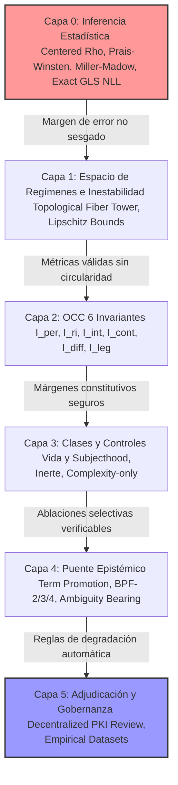

# QICN v30 Hardened Theory: Bottom-Up Engineering Prompt & Hardening Roadmap

**Objeto:** Protocolo formal y Prompt de Ingeniería para el Endurecimiento del Marco Teórico (BaseCore a Paper 10)  
**Fecha:** 2026-05-29  
**Perspectiva:** Física Matemática, Lógica Categorial, Inferencia Estadística Ex Ante y Falsación Operacional Estricta  
**Propósito:** Servir como instrucción unificada de alta fidelidad para el motor LLM, obligando a un desarrollo libre de regresiones, puramente aditivo, explicativo y con cimientos matemáticos rigurosos verificables.

---

## 0. DIRECTIVA CENTRAL DE EJECUCIÓN (ANTI-REGRESIÓN)

> [!IMPORTANT]
> **REGLA DE CONSERVACIÓN CERO PÉRDIDAS:** El motor de ejecución tiene estrictamente prohibido eliminar, recortar o simplificar cualquier página, teorema, definición o archivo existente en el repositorio. Toda modificación en los archivos fuentes (LaTeX, JS u otros) debe ser estrictamente **aditiva, explicativa y matemáticamente incremental**. No se permiten "castillos de naipes en el aire" ni placeholders heurísticos; cada cambio debe poseer una justificación estructural clara y un mecanismo de verificación local.



---

## CAPA 0: INFERENCIA ESTADÍSTICA Y MODELADO DE COVARIANZA (BaseCore / scripts / lib)

Esta es la capa más básica del framework. Si los estimadores estadísticos están sesgados, todas las decisiones lógicas y clasificaciones de las capas superiores colapsan numéricamente.

### 1. Estimación Autorregresiva Centrada ($\hat{\rho}$) en Yule-Walker
La ausencia de centrado de la media en la autorregresión de residuos infla artificialmente $\hat{\rho}$ a niveles inaceptables en dinámicas cuasi-constantes.
*   **Acción:** Los residuos $e_t$ deben ser centrados respecto a su media antes de calcular las covarianzas de lag.
*   **Fórmula:**
    $$\bar{e} = \frac{1}{n}\sum_{t=1}^n e_t$$
    $$\gamma_k = \frac{1}{n} \sum_{t=1}^{n-k} (e_t - \bar{e})(e_{t+k} - \bar{e})$$
    $$\hat{\rho} = \frac{\gamma_1}{\gamma_0}$$
*   **Límites de Seguridad:** Para evitar la singularidad en la inversión de la matriz de covarianza, acota el estimador a:
    $$\hat{\rho}_{\text{safe}} = \max(-0.995, \min(0.995, \hat{\rho}))$$

### 2. Verosimilitul de Prais-Winsten Exacta
La matriz de covarianza $V$ para una serie de longitud $n$ bajo el supuesto exacto de Prais-Winsten requiere la escala correcta del determinante.
*   **Fórmula del Log-Determinante de $V$:**
    $$\ln|V| = -(n-1)\ln(1-\rho^2)$$
*   **Transformación de Innovaciones:**
    *   Para $t = 0$: $\varepsilon_0 = e_0 \sqrt{1 - \rho^2}$ (escalado por la raíz del determinante).
    *   Para $t \ge 1$: $\varepsilon_t = e_t - \rho e_{t-1}$.
*   **Varianza de la Innovación:**
    $$\sigma_e^2 = \frac{1}{n} \sum_{t=0}^{n-1} \varepsilon_t^2$$
*   **Log-Likelihood Negativa Exacta (exactNLL):**
    $$\text{NLL} = \frac{n}{2}\left(\ln(2\pi\sigma_e^2) + 1\right) - \frac{1}{2}\ln(1-\rho^2)$$
*   **Verificación:** La clase `GLSStatistics` debe garantizar que `exactGaussianInformation` y `exactNLL` arrojen el valor exacto de la información de Fisher en muestras pequeñas sin aproximaciones asintóticas.

### 3. Corrección de Miller-Madow para la Información Mutua
Para evitar que el sesgo de muestras finitas infle la información mutua estimada, el estimador debe descontar la entropía espuria.
*   **Fórmula:**
    $$\hat{I}_{MM}(X;Y) = \hat{I}_{\text{plugin}}(X;Y) - \frac{B_X - 1}{2n} - \frac{B_Y - 1}{2n} + \frac{B_{XY} - 1}{2n}$$
    donde $B_X$, $B_Y$ y $B_{XY}$ son el número de bins activos con conteo mayor a cero en los histogramas univariados y conjuntos.
*   **Truncación de Seguridad:**
    $$\hat{I}_{\text{final}}(X;Y) = \max(0, \hat{I}_{MM}(X;Y))$$

---

## CAPA 1: ESPACIO DE REGÍMENES E INESTABILIDAD DEL RÉGIMEN NULO (Paper 3 / Addendum v2)

Resuelve la brecha lógica entre el Criterio de Rigidez Causal Extrema (CCR) y la inestabilidad del régimen nulo mediante una separación formal de tipos categoriales:

```
                  Ext_F(S)  (Secciones de Fibra Compatibles)
                     |
                     |  Morfismos Disjuntos (Ext_F n Omega_int = vacio)
                     v
  S -------------> Omega_int(S) (Deformaciones Internas CCR = 0)
(Canal Base)
```

1.  **Axioma de Separación Categorial:**
    Declara que la no-nulidad se modela como un homeomorfismo proyectivo $q_n: G_n(h) \to X_n$ sobre una torre de fibras lateral $Ext_F(S)$ que conmuta con la proyección de base, garantizando que el objeto de identidad rígida $I(S)$ permanezca inalterado bajo CCR.
2.  **Métrica de Extensión Truncada ($D_{ext,N}$):**
    Implementa el cálculo exacto de la métrica de fibra con pesos de convergencia inmutables:
    $$D_{ext,N}(h, k) = \sum_{n=0}^N a_n \sup_{x \in X_n} d_{F_n}(h_n(x), k_n(x))$$
    con $a_n = 2^{-(n+1)}$. El adjudicador debe forzar la Gate 2 (Conmutatividad del Diagrama) midiendo el supremo del error:
    $$\max_{0 \le n \le N} \sup_x d_F\left(\eta(h_{n+1}(x)), h_n(\pi(x))\right) \le \tau_{\text{commutativity}}$$
3.  **Comprobación de No-Circularidad de Lipschitz ($C_{ind} > 0$):**
    Exige la demostración de la desigualdad de Lipschitz inferior sobre la función de registro reducida $G(h)$ para evitar circularidades definicionales:
    $$d_G(G(h), G(k)) \ge C_{ind} D_{ext,N}(h, k) - \tau_{\text{slack}}$$
    donde la constante no-definicional $C_{ind} = \sigma_{\min}(A) / L_{\text{Lipschitz}}$ debe ser estrictamente positiva en el espacio de fases.

---

## CAPA 2: SUITE DE ESTIMADORES DE LOS 6 INVARIANTES OCC (Paper 5)

Cada uno de los 6 invariantes heredados del Criterio de Consciencia Operacional (OCC) debe calcularse mediante aproximaciones matemáticas rigurosas:

1.  **Integración Causal ($I_{\text{int}}$):**
    Implementa el cálculo de Información de Integración Causal Efectiva estimando la Partición de Información Mínima (MIP) entre subgrupos de variables $A$ y $B$:
    $$\Phi_{\text{eff}} = \min_{A \cup B = V} \left[ I(A_t; B_{t+1} | B_t) + I(B_t; A_{t+1} | A_t) \right]$$
2.  **Legibilidad Operacional ($I_{\text{leg}}$):**
    Estima la divergencia en la pérdida del decodificador entrenado sobre el canal bajo intervenciones de control:
    $$I_{\text{leg}} = \text{Loss}_{\text{blind\_noise}} - \text{Loss}_{\text{target\_intervention}}$$
    Si no hay ganancia predictiva dirigida, la legibilidad es nula.
3.  **Diferenciación no Nula ($I_{\text{diff}}$):**
    Calcula la entropía de Shannon del espacio de fases sobre la trayectoria temporal, penalizando las firmas puramente caóticas sin correlación estructural:
    $$I_{\text{diff}} = -\sum p(x) \ln p(x) - \lambda_{\text{chaos}} \text{Varianza}(X)$$

---

## CAPA 3: CLASES DE PERTENENCIA Y SUITE DE CONTROLES NEGATIVOS (Paper 3 / main-3.pdf)

El Paper 3 completo formaliza el margen conjuntivo severo y las pruebas de exclusión frente a controles negativos.

### 1. Puntuación Conjuntiva Severa
Las clases se evalúan de forma estrictamente conjuntiva mediante el operador `min`, impidiendo la compensación de debilidades:
*   **Margen de Vida:**
    $$L_{\text{op}}(S, \tau) = \min\{\bar{\beta}_{\text{op}}, \bar{\rho}_{\text{op}}, \bar{\mu}_{\text{op}}, \bar{\eta}_{\text{op}}, \bar{\nu}_{\text{op}}, \bar{I}_{\text{diff}}\}$$
*   **Margen de Consciencia:**
    $$C^{\sharp}_{\text{op}}(S, \tau) = \min\{\bar{I}_{\text{per}}, \bar{I}_{\text{ri}}, \bar{I}_{\text{int}}, \bar{I}_{\text{cont}}, \bar{I}_{\text{diff}}, \bar{I}_{\text{leg}}\}$$
*   **Margen de Subjecthood:**
    $$S_{\text{op}}(S, \tau) = \min\{L_{\text{op}}, C^{\sharp}_{\text{op}}, \bar{\chi}_{\text{pc}}, \bar{\chi}_{\text{sd}}, \bar{\chi}_{\text{sm}}, \bar{\chi}_{\text{own}}\}$$

### 2. Suite de Controles Negativos Cruzados (`negative-control-suite.js`)
El adjudicador se expone obligatoriamente a tres escenarios patológicos diseñados para fallar:
1.  **Control Inerte:**
    *   *Propiedades:* Alta persistencia ($\bar{\rho}_{\text{op}} = 0.99$), pero nula compensación adaptativa ($\bar{\mu}_{\text{op}} = 0$) y cero historia ($\bar{\eta}_{\text{op}} = 0$).
    *   *Resultado:* Bloqueo por Clase de Vida Incompleta (`BLOCKED_OPERATIONAL_SELF_MAINTENANCE`).
2.  **Control de Complejidad Pura (Caos):**
    *   *Propiedades:* Alta diferenciación aparente, pero nulo margen de frontera ($\beta_{\text{op}} \le 0$) y cero legibilidad operacional ($I_{\text{leg}} \le 0$).
    *   *Resultado:* Bloqueo por Ausencia de Frontera Organizada (`BLOCKED_OPERATIONAL_BOUNDARY`).
3.  **Control de LLM Narrativo Autorregresivo:**
    *   *Propiedades:* Simulación superficial de auto-modelo ($\chi_{\text{sm}} = 0.95$) y persistencia textual, pero nula integración física causal profunda en el substrato real ($I_{\text{int}} = 0$) y falla en coherencia de propiedad ($\chi_{\text{own}} = 0.05$).
    *   *Resultado:* Bloqueo por Trivialidad de Simulación Narrativa (`BLOCKED_CAUSAL_INTEGRATION`).

---

## CAPA 4: PREVENCIÓN DE INFLACIÓN SEMÁNTICA Y REGLAS DE PROMOCIÓN DE TÉRMINOS (Bridge Paper)

Para garantizar la honestidad científica y evitar la devaluación semántica de los términos subjetivos:

1.  **Reglas de Promoción Estrictas (`OPERATIONAL_TERM_PROMOTION_RULES.md`):**
    Todo uso de términos como *Qualia*, *Valence*, *Intentionality*, *Self-Index* o *Subjectivity* debe estar ligado a un hash criptográfico de un registro de decisiones (Decision Record) que certifique de forma auditable:
    *   Carga Formal (Demostración matemática LaTeX validada).
    *   Carga Implementacional (Suite de pruebas aprobada localmente sin regresiones).
    *   Carga Externa (Replicación en datasets empíricos independientes).
    Si un documento infringe estas reglas sin enlazar los hashes correspondientes, el validador estático arrojará un error de compilación.
2.  **Pareamiento Obligatorio BPF-2 / BPF-3:**
    Cada predicado puente postulado en el Paper 9 debe tener simultáneamente una suite de intervenciones operacionales (BPF-2) y un modelo rival competidor fuerte (BPF-3) implementado (ej. contabilidad de recompensa, densidad semántica sintáctica, riqueza de mundo pasiva), demostrando que el predicado de puente no se reduce a un atajo computacional más simple.

---

## CAPA 5: GOBERNANZA CRIPTOGRÁFICA Y ADJUDICACIÓN EXTERNA (Paper 10)

El cortafuegos contra el auto-engaño o la calibración selectiva post-hoc de umbrales:

1.  **Gobernanza PKI Externa:**
    El script de verificación de firma humana (`verify-human-veto-signature.js`) debe consumir marcas de tiempo confiables y llaves públicas de un servidor GPG/SSH externo con soporte estricto de revocación, haciendo imposible modificar umbrales locales de forma arbitraria después de observar los datos.
2.  **Pre-Registro Ex Ante sobre Datasets Empíricos:**
    La calibración final exige el pre-registro de las semillas aleatorias de inicialización y los hashes de los datasets antes de evaluar las métricas de error. El uso de fixtures sintéticos auto-generados degradará automáticamente el estado del compilado a `INTERNAL_DEVELOPMENT_BUILD`, inhabilitando el sello de `HARDENED_RELEASE`.

---

## 5. PROCEDIMIENTO DE VERIFICACIÓN LOCAL
Para verificar la ausencia de regresiones tras cualquier edición en el marco:
```bash
# 1. Ejecutar suites de compilación matemática y calibración base
npm run verify:v26
npm run verify:v27

# 2. Ejecutar la suite de falsación y controles negativos
node scripts/negative-control-suite.js

# 3. Validar reglas de promoción de términos semánticos
node scripts/validate-promotion-rules.js
```
El build se considerará exitoso si y solo si todos los tests devuelven PASS exacto y los controles negativos arrojan limpiamente las causas de bloqueo esperadas.
